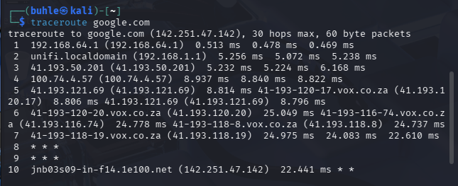
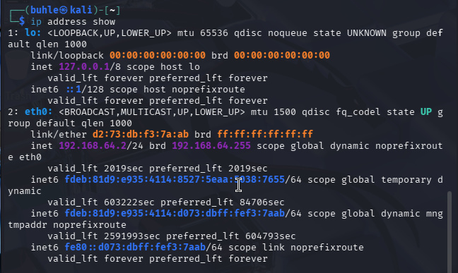
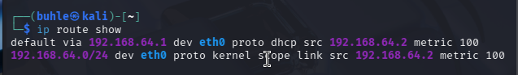

# 🌐 Day 6 – Network Snapshot Report (Linux Foundations)

## Welcome to Day 6 of my Security Engineering journey 🚀

- Today’s mission: act like a tiny network detective 🕵🏽‍♀️ and take a snapshot of my system’s network state using core Linux networking tools.

- Think of this as a “health check” for how my machine talks to the internet.

# 🧪 Mini Project: Network Snapshot Script

## 📜 Script Used (network_snapshot.sh)

```

# PING TOOL
ping -c 20 google.com

# TRACEROUTE TOOL
traceroute google.com

# IP ADDRESS SHOW
ip address show

# IP ROUTE SHOW
ip route show

```

### This script collects:

- Connectivity status 🌍

- Route path to a remote host 🛰️

- Local IP configuration 🧩

- Routing table (how packets leave my machine) 🚪➡️🌐

# 🛰️ Command Breakdown (Simple + Real Talk)

| Tool              | What It Does                       | Why It Matters                         |
| ----------------- | ---------------------------------- | -------------------------------------- |
| `ping`            | Sends packets to test connectivity | Checks if the internet is reachable    |
| `traceroute`      | Shows the path packets take        | Helps diagnose network slowdowns       |
| `ip address show` | Displays network interfaces & IPs  | Identifies my machine on the network   |
| `ip route show`   | Shows routing table                | Reveals default gateway & traffic flow |


# 📊 Network Snapshot Results & Analysis

## 1️⃣ Ping Test (Connectivity Check)

```
ping -c 10 google.com

```

## 🎥 Screenshot 


## 🔎 Result Summary:

- Packets sent: 10

- Packets received: 10

- Packet loss: 0% 🎯

- Avg latency: ~26 ms ⚡

## 🧠 Interpretation:

- My machine successfully communicated with Google’s server with zero packet loss, meaning:

- Internet connection is stable and responsive 🌐💨

- Latency around 20–40 ms = healthy connection (especially solid for VM networking).

# 2️⃣ Traceroute (Path to Destination)

```

traceroute google.com

```

## 🎥 Screenshot 



### 🛣️ Observed Route Highlights:

- ```192.168.64.1``` → Local VM gateway

- ```192.168.1.1``` → Home router

- ```41.x.x.x →``` ISP network (Vox Telecom)

- ```1e100.net``` → Google infrastructure

### 🧠 Interpretation:

- This shows the journey of packets from my Kali VM ➜ router ➜ ISP ➜ Google.

- Those ```* * *``` hops?

- They’re routers that block ICMP replies. Not an error. Just security vibes 🔒

# 3️⃣ IP Address Inspection

```
ip address show

```

## 🎥 Screenshot



## 🔎 Key Findings:

- Interface: ```eth0```

- Local IP: ```192.168.64.2/24```

- Loopback: 127.0.0.1

## 🧠 Interpretation:

- ```192.168.64.2``` → My VM’s private IP

- Loopback → Used for internal system communication

- Indicates NAT networking inside the virtual machine

- Basically:

---

My VM lives inside its own little digital apartment 🏢 and talks to the outside world through the host network.

---

# 4️⃣ Routing Table Analysis

```
ip route show

```

## 🎥 Screenshot



## 🔎 Output Insight:

```

default via 192.168.64.1 dev eth0

```

## 🧠 Interpretation:

- This line is the VIP:

    - default via ```192.168.64.1``` → Default gateway (exit door to the internet)

    - dev ```eth0``` → Traffic leaves via Ethernet interface

- Translation:

All internet traffic exits through the VM gateway 🚪➡️🌍

# 🧠 Key Concepts Learned

## 🌐 1. Network Connectivity Testing

- ping confirms reachability

- Packet loss = connection problems

- Low latency = fast network response

## 🛣️ 2. Packet Routing

- Data travels through multiple routers before reaching a destination

- Each hop = a checkpoint in the internet highway

## 🧩 3. Network Interfaces

- ```lo``` = loopback (internal communication)

- ```eth0``` = primary network interface

## 🚪 4. Default Gateway

- The default route is the main exit point from the local network to the internet.

- No gateway = no internet. Simple as that 😭