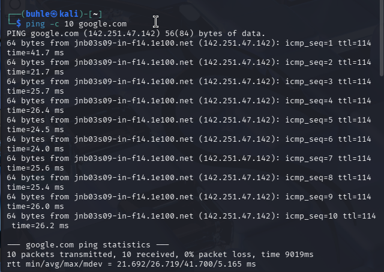

# 🌐 Day 6 – Network Snapshot Report (Linux Foundations)

## Welcome to Day 6 of my Security Engineering journey 🚀

- Today’s mission: act like a tiny network detective 🕵🏽‍♀️ and take a snapshot of my system’s network state using core Linux networking tools.

- Think of this as a “health check” for how my machine talks to the internet.

# 🧪 Mini Project: Network Snapshot Script

## 📜 Script Used (network_snapshot.sh)

```

# PING TOOL
ping -c 20 google.com

# TRACEROUTE TOOL
traceroute google.com

# IP ADDRESS SHOW
ip address show

# IP ROUTE SHOW
ip route show

```

### This script collects:

- Connectivity status 🌍

- Route path to a remote host 🛰️

- Local IP configuration 🧩

- Routing table (how packets leave my machine) 🚪➡️🌐

# 🛰️ Command Breakdown (Simple + Real Talk)

| Tool              | What It Does                       | Why It Matters                         |
| ----------------- | ---------------------------------- | -------------------------------------- |
| `ping`            | Sends packets to test connectivity | Checks if the internet is reachable    |
| `traceroute`      | Shows the path packets take        | Helps diagnose network slowdowns       |
| `ip address show` | Displays network interfaces & IPs  | Identifies my machine on the network   |
| `ip route show`   | Shows routing table                | Reveals default gateway & traffic flow |


# 📊 Network Snapshot Results & Analysis

## 1️⃣ Ping Test (Connectivity Check)

```
ping -c 10 google.com

```

## 🎥 Screenshot 




## 🔎 Result Summary:

- Packets sent: 10

- Packets received: 10

- Packet loss: 0% 🎯

- Avg latency: ~26 ms ⚡

## 🧠 Interpretation:

- My machine successfully communicated with Google’s server with zero packet loss, meaning:

- Internet connection is stable and responsive 🌐💨

- Latency around 20–40 ms = healthy connection (especially solid for VM networking).