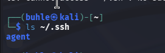
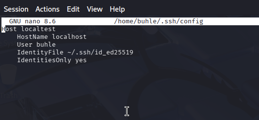

# 🔐 Day 8 – SSH (Secure Shell)

## 📌 Overview

- Today I explored SSH (Secure Shell), a protocol used to securely access and manage remote systems over an untrusted network.

- SSH encrypts communication between client and server, preventing interception and tampering. 

- It is a foundational tool in system administration, DevOps, and cybersecurity.

## 🧠 Key Concepts Learned

- Encrypted remote access

- Public key authentication

- SSH configuration files

- Port forwarding (local, remote, dynamic)

- Connection debugging with verbose mode

- Jump hosts (bastion servers)

# 🔑 SSH Command Reference Table

| Command / Option          | What It Does                                             | Example                                |
| ------------------------- | -------------------------------------------------------- | -------------------------------------- |
| `ssh user@host`           | Connect to a remote machine securely                     | `ssh buhle@192.168.1.10`               |
| `-p port`                 | Connect using a custom port                              | `ssh -p 2222 user@host`                |
| `-i identity_file`        | Use a specific private key                               | `ssh -i ~/.ssh/id_rsa user@host`       |
| `-v`                      | Verbose mode (debug connection issues)                   | `ssh -v user@host`                     |
| `-V`                      | Show SSH version                                         | `ssh -V`                               |
| `-4`                      | Force IPv4 only                                          | `ssh -4 user@host`                     |
| `-6`                      | Force IPv6 only                                          | `ssh -6 user@host`                     |
| `-l login_name`           | Specify login username                                   | `ssh -l buhle 192.168.1.10`            |
| `-N`                      | Do not execute remote command (used for port forwarding) | `ssh -N user@host`                     |
| `-T`                      | Disable pseudo-terminal allocation                       | `ssh -T user@host`                     |
| `-t`                      | Force pseudo-terminal allocation                         | `ssh -t user@host`                     |
| `-C`                      | Enable compression                                       | `ssh -C user@host`                     |
| `-q`                      | Quiet mode (suppress warnings)                           | `ssh -q user@host`                     |
| `-A`                      | Enable agent forwarding                                  | `ssh -A user@host`                     |
| `-a`                      | Disable agent forwarding                                 | `ssh -a user@host`                     |
| `-X`                      | Enable X11 forwarding (untrusted)                        | `ssh -X user@host`                     |
| `-Y`                      | Enable trusted X11 forwarding                            | `ssh -Y user@host`                     |
| `-x`                      | Disable X11 forwarding                                   | `ssh -x user@host`                     |
| `-f`                      | Run SSH in background                                    | `ssh -f user@host command`             |
| `-L local:host:port`      | Local port forwarding                                    | `ssh -L 8080:localhost:80 user@host`   |
| `-R remote:host:port`     | Remote port forwarding                                   | `ssh -R 9090:localhost:3000 user@host` |
| `-D port`                 | Dynamic port forwarding (SOCKS proxy)                    | `ssh -D 1080 user@host`                |
| `-J jump_host`            | Connect through jump/bastion host                        | `ssh -J user@jump user@target`         |
| `-O ctl_cmd`              | Control active multiplexed connection                    | `ssh -O check user@host`               |
| `-S ctl_path`             | Specify control socket for connection sharing            | `ssh -S ~/.ssh/control user@host`      |
| `-Q query_option`         | Query supported algorithms                               | `ssh -Q cipher`                        |
| `-w local_tun:remote_tun` | Create VPN tunnel                                        | `ssh -w 0:1 user@host`                 |

## 🛠️ Basic SSH Usage

1. 🛠️ Basic SSH Usage

```
ssh user@host

```

2. ssh user@host

```

ssh -p 2222 user@host

```

3. Use a specific private key

```
ssh -i ~/.ssh/id_rsa user@host

```

4. Debug connection issues

```
ssh -vvv user@host

```

## 🔑 SSH Key Authentication

### Generate SSH key pair

```
ssh-keygen -t rsa -b 4096

```

- Files created:

    - ```~/.ssh/id_rsa``` → Private key (keep secret)

    - ```~/.ssh/id_rsa.pub``` → Public key (share with server)


### Add public key to server

- Append public key to:

```
~/.ssh/authorized_keys

```

## 📂 Important SSH Files

| File                     | Purpose                    |
| ------------------------ | -------------------------- |
| `~/.ssh/id_rsa`          | Private key                |
| `~/.ssh/id_rsa.pub`      | Public key                 |
| `~/.ssh/authorized_keys` | Allowed keys on server     |
| `~/.ssh/known_hosts`     | Stores server fingerprints |
| `~/.ssh/config`          | User SSH configuration     |
| `/etc/ssh/ssh_config`    | System-wide SSH config     |


## 🌉 Port Forwarding

### Local Port Forwarding

```
ssh -L 3000:localhost:3000 user@host

```

### Remote Port Forwarding

```
ssh -R 9090:localhost:3000 user@host

```

### Dynamic Port Forwarding (SOCKS Proxy)

```
ssh -D 1080 user@host

```

### 🧭 Jump Host Connection

```
ssh -J user@bastion user@internal-server

```
- Used when accessing a private network through a gateway server.


# 🎯 Mini Project: Set Up and Document SSH Config

## 🧠 Goal

- Create a reusable SSH configuration file that:

    - Uses an alias instead of raw IP

    - Specifies username

    - Uses a private key

    - Optionally sets custom port

    - Makes your life 10x easier

- Then document it like a pro.

## 🛠 Step 1: Locate or Create SSH Config File

- Check if it exists:

```
ls ~/.ssh

```

### 🎥 Screenshot



- From this we can deduce that:
    - ```.ssh``` directory exists ✅

    - But I do not currently have:

        - a config file

        - a private key like id_rsa or id_ed25519

        - known_hosts

        - authorized_keys


## 🛠 Step 2: Check If You Have SSH Keys

```
ls ~/.ssh/id_*

```

### 🎥 Screenshot


- Since it says "No such file", I need to generate one

## 🔑 Step 3: Generate SSH Key && Troubleshooting

- Attempted connection to 192.168.1.10 resulted in:

```
Connection timed out

```

- Diagnosis:

    - IP address not reachable on local network

- Resolution:

    - Tested with localhost to confirm configuration works

    - Verified SSH service is running

- Recruiters LOVE seeing troubleshooting sections. 

## 🧾 Step 2: Add a Host Entry

- Open the file:

```

nano ~/.ssh/config

```
- Add host configuration:

```
Host myserver
    HostName 192.168.1.10
    User buhle
    Port 2222
    IdentityFile ~/.ssh/id_rsa

```
### 🎥 Screenshot



- Let’s decode that:

| Line         | Meaning                |
| ------------ | ---------------------- |
| Host         | Alias name you’ll type |
| HostName     | Real IP or domain      |
| User         | Default login user     |
| Port         | Custom SSH port        |
| IdentityFile | Private key to use     |

- Save. Exit.

## 🚀 Step 3: Test It

- Now instead of:

```
ssh buhle@192.168.1.10 -p 2222

```

- You type:

```
ssh myserver

```

- And boom!

## 🧠 Key Learnings

- SSH config simplifies command usage

- Proper file permissions are critical

- Multiple hosts can be managed cleanly

- Improves workflow efficiency

## 🔐 Security Considerations

- Private keys must remain secure

- Config file permissions set to 600

- Avoid storing passwords